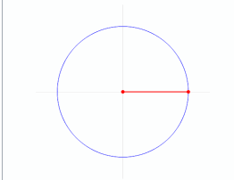

# NMR-Log-Echo-Train-Inversion-in-Geolog-using-Scipy-Optimization
# NMR Echo Train processing and creation of an NMR log in Real-Time:

This Jupyter Notebook uses the existing MRIL T2 bin porosities to create an NMR log echo train with random noise that is then used to test one of our 3 SciPy metods for T2 inversion. 

The T2 inversion methods developed in this notebook were developed with collaboration with chatGPT. We wanted to experiment with this AI tool to see if we could create the code to perform NMR log T2 inversion. We are using SciPy least_squares, optimization and curve_fit libraries in Python with Tikhonov regularization, which incorporates a penalty term based on the sum of the squared parameters. Although the initial code provided by ChatGPT required some fine-tuning, it was a great starting point.

Our [repository on GitHub](https://github.com/Philliec459/NMR-Log-Echo-Train-Inversion-in-Geolog-using-Scipy-Optimization) also includes a complete Geolog project with Geolog python loglans to perform the same process as used in this notebook.

The process starts with creating an echo train with random noise from the existing bin porosities from a MRIL C tool job using the multi-exponential decay rate defined by the function below:

    def func(x,p1,p2,p3,p4,p5,p6,p7,p8):
    return (p1*np.exp(-x/4)+p2*np.exp(-x/8)+p3*np.exp(-x/16)+p4*np.exp(-x/32)+p5*np.exp(-x/64)+p6*np.exp(-x/128)+p7*np.exp(-x/256)+p8*np.exp(-x/512))

The time axis, xdata, is in msec for 200 echoes with a TE of 1.2 msec:

    # create x array with 200 elements
    num_echoes = 200
    TE = 1.2  # echo spacing (ms)
    x = np.arange(num_echoes) * TE
    xdata = x

We add random noise to this echo train using the code below: 

    y_noise  = noise * np.random.normal(size=xdata.size)
    ydata = y + y_noise

We then apply our T2 inversion using this synthetic echo train with noise employing one of the 3 methods from SciPy shown below: 

    '''
    -----------------------------------------------------------------------------------------------
      T2 Inversion using SciPy with regularization or SciPy curve_fit options:
    -----------------------------------------------------------------------------------------------
    '''
 
    if method == 'least_squares' : 
        # Set the value of alpha
        alpha = 0.1
        # Set the initial parameter values
        p0 = np.ones(8)
        # Set the bounds
        bounds = ([0]*8, [20]*8)
        # Fit the data to the function with L2 regularization using scipy.optimize
        result = least_squares(objective, p0, args=(xdata, ystack, alpha), bounds=bounds)
        popt = result.x    
    elif method == 'Optimize':
        lambda_ = 0.1  #started with 0.1
        p0 = np.ones(8)
        result = minimize(obj_func, p0, args=(xdata, ystack, lambda_), method='L-BFGS-B', bounds=[(0, 20)]*8)
        popt = result.x
    elif method == 'Curve_fit_simple' : 
        popt, pcov = curve_fit(func, xdata, ystack, method='trf', bounds=(0.05, [20, 20, 20, 20, 20, 20, 20, 20])) 
        

### Channel X and Y Data
In an attempt to make this more realistic, we created our own Channel X and Channel Y data from the original echo train (ydata) using our pre-defined phase rotation values in radians to calculate the X and Y data. We then again use phase rotation correction to create a phase corrected echo train for the T2 inversion similar to what we might do with the channel echo train data on a typical MRIL run well using the following code:

### Calculate a pseudo X and Y channle data bassed on the phase_angle_radian and the origial echo train ydata

#### [We are using phase angles in radians](https://en.wikipedia.org/wiki/Radian).
    
  

Rotate the initial echo train to create X and Y component data:

    Channel_X = ydata * np.cos(phase_angle_rad) # Echo train real
    Channel_Y = ydata * np.sin(phase_angle_rad)  # Quadrature channel

and then re-apply the phase rotation to create a new echo train for the T2 inversion:

    echo_train_real = np.real(Channel_X) / np.cos(phase_angle_rad)
    echo_train_imag = np.imag(Channel_Y) / np.sin(phase_angle_rad)

Prior to T2 inversion, we typically stack the echo_train_real for better signal to noise, and then apply one of the 3 SciPy inversion techniques as shown above. 

We also have all of this code as [Geolog python loglans with a complete Geolog project included in our GitHub repository](https://github.com/Philliec459/NMR-Log-Echo-Train-Inversion-in-Geolog-using-Scipy-Optimization).

In this project there is a Geolog layout to view the new T2 inversion results along with the original NMR log data to compare the results.

Please let us know if there are any issues.
