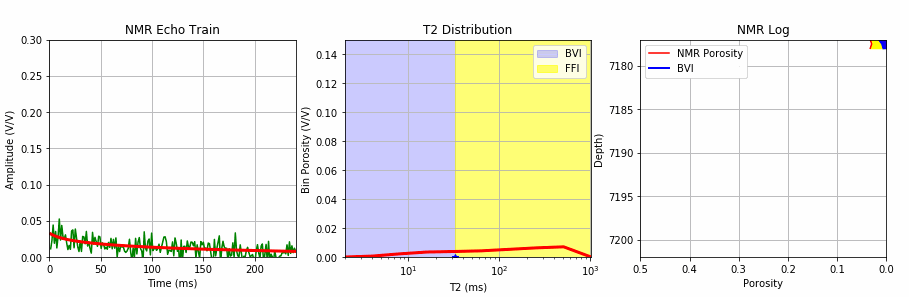
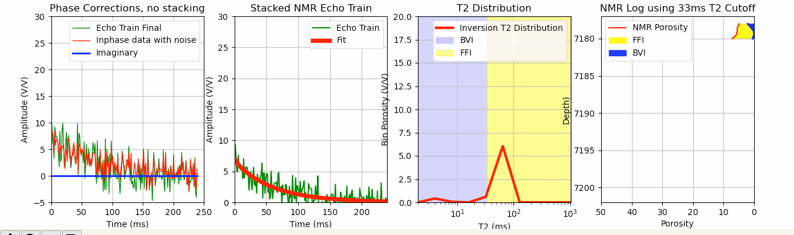
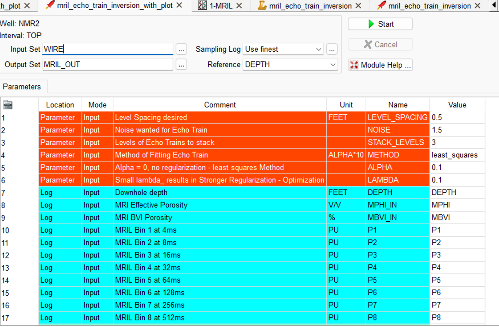

# NMR-Log-Echo-Train-Inversion-in-Geolog-using-Scipy-Optimization
This repository employs NMR log echo train inversion using Scipy least_squares or optimization using Tikhonov regularization, which adds a penalty term equal to the sum of the squares of the parameters. 

We would like to thank Tim Putnam for introducing us to chatGPT. ChatGPT has become quite popular lately, so we decided to experiment with using this AI tool to perform NMR log T2 inversion using the SciPy least_squares and optimization libraries in Python with Tikhonov regularization, which incorporates a penalty term based on the sum of the squared parameters. Although the initial code provided by ChatGPT required some fine-tuning, it was a great starting point.

This repository includes a Jupyter Notebook as well as a complete Geolog project with Geolog python loglans, layouts and Geolog project structure.  

This Jupyter Notebook uses the existing MRIL T2 bin porosities to create an NMR log echo train with introduced noise that we will then be used for the T2 inversion. 

This T2 inversion method was developed in collaboration with chatGPT which has become quite popular lately, so I decided to experiment with using this AI tool to perform this NMR log T2 inversion using the SciPy optimization library in Python with Tikhonov regularization, which incorporates a penalty term based on the sum of the squared parameters. Although the initial code provided by ChatGPT required some fine-tuning, it was a great starting point.

The repository on GitHub also includes a complete Geolog project with Geolog python loglans to complete the same process.

The process starts with the existing bin porosities for a MRIL C tool well where we create an echo train with the multi-exponential decay rate shown in the function below:

    def func(x,p1,p2,p3,p4,p5,p6,p7,p8):
    return (p1*np.exp(-x/4)+p2*np.exp(-x/8)+p3*np.exp(-x/16)+p4*np.exp(-x/32)+p5*np.exp(-x/64)+p6*np.exp(-x/128)+p7*np.exp(-x/256)+p8*np.exp(-x/512))

In essence we could just add noise to this 

    y_noise  = noise * np.random.normal(size=xdata.size)
    ydata = y + y_noise

where xdata is the time in msec for 200 echoes with a TE of 1.2 msec:

    # create x array with 200 elements
    num_echoes = 200
    TE = 1.2  # echo spacing (ms)
    x = np.arange(num_echoes) * TE
    xdata = x

and ydata is the echo train amplitudes.

After that all we would really need to do is apply some form of T2 inversion of the new synthetic echo train with noise using some methods from SciPy. 

    '''
    -----------------------------------------------------------------------------------------------
      T2 Inversion using SciPy with regularization or SciPy curve_fit options:
    -----------------------------------------------------------------------------------------------
    '''
 
    if method == 'least_squares' : 
        # Set the value of alpha
        alpha = 0.1
        # Set the initial parameter values
        p0 = np.ones(8)
        # Set the bounds
        bounds = ([0]*8, [20]*8)
        # Fit the data to the function with L2 regularization using scipy.optimize
        result = least_squares(objective, p0, args=(xdata, ystack, alpha), bounds=bounds)
        popt = result.x    
    elif method == 'Optimize':
        lambda_ = 0.1  #started with 0.1
        p0 = np.ones(8)
        result = minimize(obj_func, p0, args=(xdata, ystack, lambda_), method='L-BFGS-B', bounds=[(0, 20)]*8)
        popt = result.x
    elif method == 'Curve_fit_simple' : 
        popt, pcov = curve_fit(func, xdata, ystack, method='trf', bounds=(0.05, [20, 20, 20, 20, 20, 20, 20, 20])) 
        

However, we wanted to try to make this more realistic by first creating an echo train with real and imaginary data, and then using phase rotation to calculate a phase corrected echo train for the T2 inversion. We attempted to do this by using the following code:

    # Calculate the echo train for each channel
    y_inphase = func(x, p1, p2, p3, p4, p5, p6, p7, p8)
    y_quadrature = func(x+T2_times[-1]*3/4, p1, p2, p3, p4, p5, p6, p7, p8)

    # Add noise to each channel
    noise_level = 1.5
    y_with_noise_inphase = y_inphase + noise_level * np.random.normal(size=y_inphase.shape)
    y_with_noise_quadrature = y_quadrature + noise_level * np.random.normal(size=y_quadrature.shape)

    # Calculate phase angle
    phase_angle = np.arctan2(np.imag(y_with_noise_inphase) - np.imag(y_with_noise_quadrature), np.real(y_with_noise_inphase) - np.real(y_with_noise_quadrature))

    # Apply phase rotation to quadrature channel
    y_imaginary = y_with_noise_quadrature * np.exp(-1j * phase_angle)

    # Combine real and imaginary channels to create final echo train
    echo_train_real = y_with_noise_inphase + np.real(y_imaginary)
    echo_train_imaginary = np.imag(y_imaginary)
    ydata = echo_train_real

We then stack the echo_train_real for better signal to noise and then perform the inversion using the same SciPy T2 inversion techniques as before. 

We also have all of this code as Geolog python loglans with a complete Geolog project included in this repository. 

>

Please let us know if there are any issues. 
