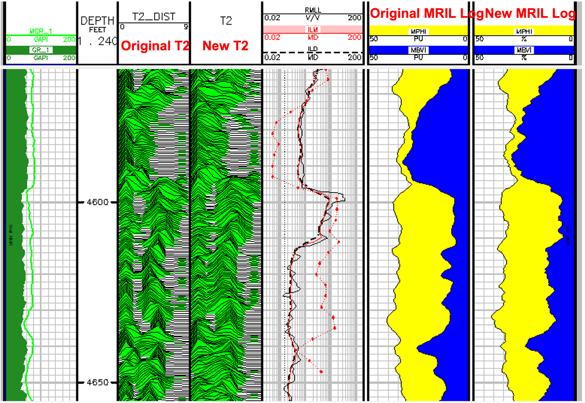

# NMR-Log-Echo-Train-Inversion-in-Geolog-using-Scipy-Optimization
This repository employs NMR log echo train inversion using Scipy least_squares or optimization using Tikhonov regularization, which adds a penalty term equal to the sum of the squares of the parameters. 

We would like to thank Tim Putnam for introducing us to chatGPT. ChatGPT has become quite popular lately, so we decided to experiment with using this AI tool to perform NMR log T2 inversion using the SciPy least_squares and optimization libraries in Python with Tikhonov regularization, which incorporates a penalty term based on the sum of the squared parameters. Although the initial code provided by ChatGPT required some fine-tuning, it was a great starting point.

This repository includes a Jupyter Notebook as well as a complete Geolog project with Geolog python loglans, layouts and Geolog project structure.  

To create our echo train we are using the 8 bin porosities supplied with the NMR MRIL type of log to create an echo train with a TE of 1.2msec and 200 echoes. We then add random noise to create a realistic echo train as shown in the image below. It is common to stack the echoes to reduce some noise prior to the T2 inversion in this example.  

>

We allow you to choose between the SciPy least_squares, optimization or curve_fit methods for the T2 inversion. All methods were mentioned by chatGPT, but the SciPy least_squares method appears to be the best using the alpha regularization. An alpha of 0 is no regularization.  

We would suggest that you start with the Jupyter Notebook as a sort of help file with some documentation to better understand the workflow. The Geolog project can also be used with Geolog20+ where you have python installed for Geolog. 

>

We are using SciPy’s optimization or least_squares methods to perform our T2 inversion. Both methods have a regularization term too. The following lines of code show how we call each method; least_squares, optimization and curve_fit that does not use regularization. 

      if method == 'least_squares' : 
            # Set the value of alpha
            alpha = 0.1
            # Set the initial parameter values
            p0 = np.ones(8)
            # Set the bounds
            bounds = ([0]*8, [20]*8)
            # Fit the data to the function with L2 regularization using scipy.optimize
            result = least_squares(objective, p0, args=(xdata, ystack, alpha), bounds=bounds)
            popt = result.x    
        elif method == 'Optimize':
            lambda_ = 0.1  #started with 0.1
            p0 = np.ones(8)
            result = minimize(obj_func, p0, args=(xdata, ystack, lambda_), method='L-BFGS-B', bounds=[(0, 20)]*8)
            popt = result.x
        elif method == 'Curve_fit_simple' : 
            popt, pcov = curve_fit(func, xdata, ystack, method='trf', bounds=(0.05, [20, 20, 20, 20, 20, 20, 20, 20]))        
 
 The image below shows the original T2 distribution and then the new T2 Inversion results using least_squares with a regularization alpha of 0.1.
 
>

We have also attempted to create a more realistic echo train with real and imaginary channels, apply the phase correction for the final echo train and then perform the final T2 inversion. This is way out of my league and still trying to check the validity of this approach. 

>

Let us know if there are any issues. 
