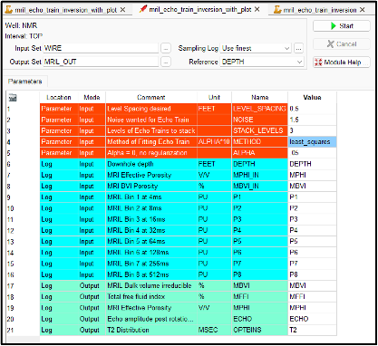

# NMR-Log-Echo-Train-Inversion-in-Geolog-using-Scipy-Optimization
This repository uses NMR log echo train inversion using Scipy optimization using Tikhonov regularization, which adds a penalty term equal to the sum of the squares of the parameters. 

ChatGPT has become quite popular lately, so I decided to experiment with using this AI tool to perform NMR log T2 inversion using the SciPy optimization library in Python with Tikhonov regularization, which incorporates a penalty term based on the sum of the squared parameters. Although the initial code provided by ChatGPT required some fine-tuning, it was a great starting point.

This repository includes a Jupyter Notebook as well as a complete Geolog project with Geolog python loglans. 

We use the 8 bin porosities supplied with the NMR log to create an echo train using a TE of 1.2msec with 200 echoes similar to the echo train from a MRIL tool. We then add noise to create a realistic echo train with random noise and then stack the echoes to reduce some noise prior to the T2 inversion. 

>

We allow you to choose between SciPy least_squares, optimization or curve_fit for the T2 inversion. All methods were mentioned by chatGPT, but the SciPy least_squares method appears to be the best using the alpha regularization. 

We would suggest that you start with the Jupyter Notebook as a sort of help file with some documentation. The Geolog project can be used with Geolog20+ where you have python installed for Geolog. Consider this work in progress and any advice or constructive criticism is welcome. 

>

